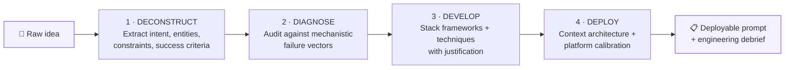

<div align="center">

# 🧠 Master Prompt Engineer

### A Claude Agent Skill that turns a one-line idea into a production-grade, platform-calibrated prompt

[](./LICENSE)
[](./master-prompt-engineer/SKILL.md)
[-6f42c1)](https://agentskills.io)
[](./master-prompt-engineer/references)

**You don't write prompts here — you engineer them.**

[What it does](#-what-it-does) •
[Install](#-installation) •
[Usage](#-usage) •
[How it works](#-how-it-works-the-4-d-methodology) •
[Reference library](#-reference-library) •
[Repo structure](#-repository-structure) •
[Changelog](#-versioning--changelog)

</div>

---

## 🚀 What It Does

Give this skill a rough idea and a target AI. It gives you back a **deployable, self-contained prompt** — the kind you paste cold into a fresh AI session and get elite, reproducible output from, with zero prior context.

```
You:    "GPT-5 — a zero-shot customer support triage system"

Skill:  → Diagnoses the request against 6 mechanistic failure vectors
        → Selects frameworks + techniques with documented justification
        → Applies GPT-5-specific calibration (zero-shot first, snapshot pinning, markdown headers)
        → Architects context placement (reference data at start, active instructions at end)
        → Returns the full prompt + an engineering debrief explaining every decision
```

It is **not** a prompt template library. It's an operating system for prompt construction — grounded in how transformer attention actually behaves, and calibrated per-model for 2025–2026 architectures (Claude, GPT-5/o-series, Gemini, DeepSeek, Grok, Llama, and more).

### Why this exists

Most "prompt improvers" pattern-match to generic advice ("be more specific," "add examples"). This skill instead:

- **Grounds every decision mechanistically** — why a constraint goes at the *start* of context, not the middle; why negative framing costs you output quality; why o-series models need CoT *stripped*, not added.
- **Calibrates per target model**, not generically — Claude 4.x's literal instruction-following needs explicit scope statements; GPT-5's zero-shot inference needs the opposite treatment; Gemini wants the question placed *last*.
- **Cites its claims.** Every performance figure attached to a technique traces to a real paper (arXiv-linked) or a verified Anthropic source — not an invented statistic. Where a number couldn't be verified, it was removed and flagged rather than left in.
- **Separates single-shot prompts from agentic systems.** A LinkedIn post and a coding agent's system prompt are different engineering problems; this skill knows which tier of the library each one needs.

---

## 📦 Installation

This repo is a **Claude Agent Skill** — a folder with a `SKILL.md` file that Claude discovers and invokes automatically. Pick the install path that matches how you use Claude:

<details>
<summary><b>Claude Code</b> (filesystem-based, no upload needed)</summary>

```bash
# Personal (available in every project)
git clone https://github.com/<your-username>/master-prompt-engineer.git ~/.claude/skills/master-prompt-engineer

# Or project-local (available only in this repo)
git clone https://github.com/<your-username>/master-prompt-engineer.git .claude/skills/master-prompt-engineer
```

Claude Code detects the skill automatically on your next session — just describe what you want engineered.

</details>

<details>
<summary><b>claude.ai</b> (custom Skill upload)</summary>

1. Download this repo as a ZIP.
2. Re-zip the `master-prompt-engineer/` folder so it is the **root** of the archive (not nested inside another folder).
3. In claude.ai: **Settings → Capabilities → Skills → Upload skill** and select the ZIP.
4. The skill is now available in your conversations on that account.

</details>

<details>
<summary><b>Claude API</b> (Skills API)</summary>

Upload the `master-prompt-engineer/` folder as a custom Skill (zip or directory), then reference it by ID in your container config alongside the code-execution tool:

```python
container={
    "skills": [
        {"type": "custom", "skill_id": "<your-uploaded-skill-id>", "version": "latest"}
    ]
}
```

See Anthropic's [Agent Skills API guide](https://platform.claude.com/docs/en/build-with-claude/skills-guide) for the full upload flow.

</details>

---

## 💬 Usage

Once installed, just talk to it — no slash command syntax required. Tell it two things: **target AI** and **your idea**.

```
Claude Opus 4.8 — An AI that helps startup founders write investor pitch decks
o3 — A prompt for advanced financial modeling and scenario analysis
GPT-5 — A zero-shot customer support triage system
Gemini 2.x — A competitive analysis and market research AI
Universal — A master customer support AI with escalation logic
```

Don't know the target model well? Say **`Universal`** and it builds cross-platform (plain structure, no vendor-specific tokens). Every response comes back in three parts:

1. **Engineering debrief** — what was built and why, in plain language
2. **The prompt itself** — ready to copy-paste, fenced and clearly marked
3. **Tuning notes** — pro tips, failure modes to watch for, and what to edit if output needs adjusting

---

## ⚙️ How It Works: The 4-D Methodology



| Phase | What happens |
|---|---|
| **1 · Deconstruct** | Maps core intent, key entities, the output contract, the constraint surface, and — critically — defines what a *bad* output looks like so it can serve as a negative verification target |
| **2 · Diagnose** | Audits the request against failure vectors: lexical flatness, attention collapse (constraints buried mid-context), missing contrastive boundaries, thin identity anchoring, platform mismatch |
| **3 · Develop** | Selects frameworks (CO-STAR, RISEN, CRISPE, POWER, TRACE+BAB, ReAct...) and techniques (Chain-of-Draft, Step-Back, Constitutional Self-Critique, Meta-Prompting...) with a documented mechanistic reason for each — never by habit |
| **4 · Deploy** | Architects context placement (reference data first, active instructions + quality gate last, critical constraints repeated at both ends), and applies the target model's 2025–2026 calibration profile |

### Model calibration at a glance

| Target | Key behavior | What the skill does differently |
|---|---|---|
| Claude 4.x / Opus 4.8 | Literal — doesn't generalize scope | Explicit scope statement on every instruction; XML-heavy structure |
| GPT-5 | Elite zero-shot inference | Tries zero-shot first; direct constraints; recommends snapshot pinning for production |
| o-series / Extended Thinking | Internal latent reasoning | Strips external CoT entirely — external chain-of-thought *degrades* these models |
| Gemini 2.x | Prefers few-shot + short prompts | Includes 1–3 examples; places the task question last, after context |
| DeepSeek-V3/R1 | Strong reasoning, weak default prose style | Explicitly dictates tone, vocabulary, and cadence |
| Grok-4.x | Huge context window, thrives on creative latitude | Frames a defined outcome rather than a rigid instruction set |
| Llama / open-source | Weaker instruction-following | Maximally explicit steps, more worked examples, exact output templates |
| Universal | No fixed target | Plain numbered structure, no vendor-specific tokens, portable across any AI |

Beyond broad model families, `references/platforms.md` also includes an **Extended Product Directory** covering ~20 specific named products and surfaces — Cursor, Perplexity (core/Comet/Voice), Le Chat, Grok's X-reply mode, Notion AI, Gemini CLI/Antigravity/Jules, Copilot (Word/CLI/GitHub/VS Code Agent), Qwen, ChatGPT persona presets, and coding-agent CLIs generally.

---

## 📚 Reference Library

The `SKILL.md` file is the operating core; the heavy detail lives in `references/` so the skill loads only what a given request actually needs.

| File | Contents |
|---|---|
| **`techniques.md`** | Full technique library — meta-prompting tier, mechanistic explanations, worked examples, and a Research Foundations table linking every performance claim to a verifiable arXiv paper |
| **`frameworks.md`** | Every named framework with worked examples: the 6-Component Spec, CO-STAR, RISEN, CRISPE, BAB, TRACE, CRAFT, POWER, RACE, Agile Prompting |
| **`platforms.md`** | Per-platform playbooks for the full 2025–2026 model matrix, plus the Extended Product Directory of ~20 specific named tools |
| **`anti-patterns.md`** | Failure modes, a 2026 obsolescence list, production brittleness patterns, and an adversarial-vulnerability catalog grounded in real published papers (Many-Shot Jailbreaking, Constitutional AI, The Instruction Hierarchy, and prompt-injection benchmarking research) |
| **`production-patterns.md`** | **Tier 5** — the operating-loop layer for agents, personas, and system prompts. 27 patterns distilled from a large survey of publicly circulated system-prompt archives (tool-trigger specs, ambiguity protocols, plan-then-execute gating, sub-agent delegation, and more), plus a verified Agent Ecosystem Standards section covering MCP, Agent Skills, and A2A |
| **`unknowns-discovery.md`** | Pre-build and mid-build elicitation layer: the Four Unknowns diagnostic (known knowns/unknowns, unknown knowns/unknowns) and 8 named techniques for agentic or high-novelty builds, sourced from a verified official Anthropic post |
| **`context-engineering.md`** | Anthropic's actual context-management framework — context rot and the attention budget, system-prompt altitude, pre-fetch vs. just-in-time retrieval, and the three long-horizon techniques (compaction, structured note-taking, sub-agent architectures) |

Every reference file is used **on demand**, not loaded wholesale — single-shot content generation only pulls Tiers 1–4; agentic, persona, or system-prompt deliverables additionally pull Tier 5, the Unknowns Discovery Protocol, and the context-engineering layer.

> **A note on provenance:** this skill is careful to distinguish verified sources (official Anthropic posts and papers, checked by direct fetch) from community-maintained archives of unconfirmed origin. Where the latter was used (Tier 5's production patterns), that's flagged explicitly in the file itself rather than presented as confirmed vendor fact.

---

## 🗂 Repository Structure

```
master-prompt-engineer/
├── LICENSE
├── README.md
└── master-prompt-engineer/
    ├── SKILL.md                          ← the skill itself (frontmatter + operating instructions)
    └── references/
        ├── techniques.md                 ← technique library + research foundations
        ├── frameworks.md                 ← named prompt frameworks, worked examples
        ├── platforms.md                  ← per-model calibration + product directory
        ├── anti-patterns.md              ← failure modes + adversarial vulnerability catalog
        ├── production-patterns.md        ← Tier 5: agentic / persona / system-prompt patterns
        ├── unknowns-discovery.md         ← pre-build elicitation protocol
        └── context-engineering.md        ← agent context-window management
```

---

## 🧭 Design Principles

Ten operating rules govern every prompt this skill produces:

1. **Structure-first, depth-by-requirement** — a tight, complete spec beats a padded one
2. **Mechanistic reasoning governs every choice** — grounded in how transformers actually attend to context
3. **Platform adaptation is mandatory** — no one-size-fits-all output
4. **Positive framing is the default** — "do X" outperforms "don't do Y"
5. **Context architecture governs long prompts** — reference data at top, active instructions at bottom, critical constraints at both ends
6. **Self-contained design** — the output assumes zero prior context in the target session
7. **Explicit scope on every instruction** — especially critical for literal-interpreting models
8. **Production resilience engineered in** — declarative specs survive model version updates; descriptive ones don't
9. **Every interaction teaches** — the debrief explains *why*, not just *what*
10. **No tiers, no shortcuts** — every output is built to the same standard

---

## 📝 Versioning & Changelog

The skill is on **v3.4.0**. Every version bump documents what changed and why directly inside `SKILL.md`'s YAML frontmatter — including corrections made when a previously cited statistic couldn't be verified against its source paper. See the [full changelog](./master-prompt-engineer/SKILL.md) at the top of that file.

---

## 🤝 Contributing

Issues and PRs are welcome — especially:
- New verified research citations for existing techniques
- Additional platform/product calibration profiles
- Corrections to any claim that doesn't hold up against its cited source

If you're adding a performance claim, please link the primary source (paper, official vendor post) rather than a secondary summary — this skill's own changelog is a record of past claims that had to be walked back for exactly that reason.

---

## 📄 License

[MIT](./LICENSE) © Kaustubh Barve

</div>
